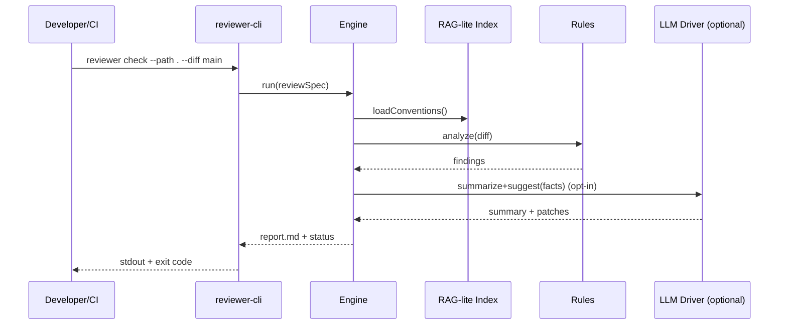

# Product Requirements Document (PRD)

**Product**: Intelligent Code Review Agent (CLI‑first MVP)

**Version**: 1.0

**Status**: Draft

**Date**: September 13, 2025

**Owner**: Benediktus (PM) — with Lead Architect support

---

## 1) Vision & Problem Statement

### Vision

A context‑aware, security‑first **AI code review agent** that runs locally or in CI to summarize changes, find high‑impact issues (not noise), and propose minimal, reviewable fixes — **without vendor lock‑in** to any single LLM.

### Problem

Code review has become a bottleneck. Large, AI‑generated PRs overwhelm human reviewers; subtle architectural and security flaws slip through. Traditional scanners are noisy and context‑blind. Teams need a reviewer that understands **their** codebase, flags **what matters**, and respects **privacy**.

### Core Hypothesis (MVP)

> With deep repository context (RAG‑lite) + high‑signal security rules + targeted LLM assistance, we can reduce review time by 5–10× while **improving** security/quality and **lowering** false positives.

---

## 2) Goals & Non‑Goals

### Goals (MVP)

1. **Accelerate reviews**: actionable summary + hotspots in < 5 minutes per PR.
2. **Catch critical issues early**: OWASP‑focused SAST‑lite + secret/credential leak detection.
3. **Context‑aware suggestions**: align with repo conventions using a lightweight index.
4. **Actionable output**: Markdown report + minimal diffs, clear rationale.
5. **Provider‑agnostic**: support GPT, Claude, DeepSeek, and local/self‑hosted models via a pluggable driver.
6. **Privacy‑first**: default to offline/null‑LLM mode; optional redacted calls to external LLMs.

### Non‑Goals (MVP)

* Inline PR comments/Checks API bot (post‑MVP).
* DAST, full SCA, or deep language coverage (start with Go + generic patterns).
* Autonomous code commits (guard‑railed remediation comes later).
* IDE plugins.

---

## 3) Success Metrics

* **P50 end‑to‑end runtime**: ≤ 5 minutes per typical PR (≤ \~300 changed LOC, 50 files).
* **False positive rate**: ≤ 15% on curated fixtures.
* **Reviewer usefulness**: ≥ 4/5 average rating in pilot teams.
* **Adoption**: ≥ 10 active repos use CLI in CI within first 30 days.
* **Security value**: ≥ 5 critical issues blocked pre‑merge across pilots in first 60 days.

---

## 4) Personas

* **Priya — Senior Developer/Reviewer**: wants to focus on architecture, not nitpicks. Overloaded by large PRs.
* **Leo — Junior Developer/Author**: wants quick, instructive feedback and concrete fix examples.
* **Asha — Eng Manager**: needs faster cycle time and fewer post‑merge regressions.
* **Rizal — AppSec Lead** (secondary): wants fewer secrets leaked and earlier detection of risky patterns.

---

## 5) Scope (MVP)

### In Scope

* **CLI**: `reviewer check --path . --diff main` (local & CI).
* **Outputs**: `review_report.md` + stdout summary; CI‑friendly exit codes.
* **Security checks** (SAST‑lite): Top OWASP families (SQLi, XSS‑like sinks for web backends as applicable), secrets/credentials, unsafe HTTP/timeouts.
* **Context index (RAG‑lite)**: index repo main branch to detect deviations from conventions (error handling, logging, function signatures).
* **LLM abstraction**: providers for GPT, Claude, DeepSeek, and a `null` offline provider.
* **Privacy defaults**: redaction (secrets, tokens) and **no external calls by default**.

### Out of Scope (Post‑MVP)

* GitHub/GitLab bot with inline comments.
* DAST, dependency/SCA, SBOM generation.
* Auto‑patch application/PR updates.
* IDE extensions.

---

## 6) Epics, User Stories, Acceptance Criteria

### Epic A — CLI & Developer Experience

**A1. Install & Help**
*As a developer, I can install the CLI and see commands.*
**AC**: `reviewer-cli --help` lists `check`, `index`, `print-config`, `version`.

**A2. Config**
*As a developer, I can configure models, budgets, and path filters.*
**AC**: `reviewer.toml` supports provider selection (`null|openai|anthropic|deepseek`), model name, token/budget caps, temperature, allow/deny paths, redaction on/off; `print-config` shows effective config.

**A3. CI Integration**
*As a maintainer, I can run the tool in CI and gate on findings.*
**AC**: GitHub Actions + GitLab CI templates; exit code `0` (clean) / `1` (issues). Artifact upload of `review_report.md`.

### Epic B — Security & Quality Analysis (Rules‑first)

**B1. Secrets Detection**
*As a reviewer, I’m alerted to potential credentials in diffs.*
**AC**: Detects common key/token patterns; shows location, severity, remediation tip.

**B2. SQL Injection (Go backend)**
*As a reviewer, I’m warned on unsafe string concatenation in DB queries.*
**AC**: Flags `db.Query*`/`Exec` with concatenated inputs; suggests parameterization and code snippet.

**B3. Unsafe Networking/Timeouts**
*As a reviewer, I’m warned when outbound I/O lacks timeouts/context.*
**AC**: Flags `http.Client{Timeout:0}` and I/O calls lacking context with cancellation; suggests safe patterns.

**B4. Noise Controls**
*As a maintainer, I can tune thresholds to reduce noise.*
**AC**: Severity thresholds, path filters, rule toggles in config.

### Epic C — Context‑Aware Analysis (RAG‑lite)

**C1. Index Main Branch**
*As the agent, I build a lightweight index of main for conventions.*
**AC**: Stores symbols/filenames/patterns locally (no code leaves machine). Incremental updates.

**C2. Deviation Detection**
*As a reviewer, I see when new code violates existing conventions.*
**AC**: Flags inconsistent error handling/logging/function signatures with examples from repo.

### Epic D — Reporting & Summaries

**D1. PR Summary**
*As a reviewer, I get a short natural‑language summary of changes.*
**AC**: First report section includes purpose, scope, and key changes.

**D2. Hotspots & Critical Files**
*As a reviewer, I see prioritized review areas.*
**AC**: Top 5 hotspots (by risk/impact/complexity) are listed with rationale.

**D3. Suggested Fixes**
*As a developer, I get minimal diffs with explanation.*
**AC**: Each high‑severity finding includes a before/after snippet and rationale.

**D4. Diagrams**
*As a reviewer, I can visualize flows.*
**AC**: Mermaid sequence diagram stubs for call chains (>3 hops) included in report.

---

## 7) Non‑Functional Requirements

* **Performance**: full run ≤ 5 minutes P50; index reuse for subsequent runs; parallel scan where safe.
* **Accuracy**: ≤ 15% false positives on curated fixtures; prefer precision over recall in MVP.
* **Privacy & Security**: default `llm-null`; explicit opt‑in for external LLMs; secrets redaction on by default; file allow/deny lists.
* **Determinism**: CI mode with pinned model versions, low temperature, repeatable prompts.
* **Portability**: macOS (arm64/x86\_64) and Linux; minimal runtime deps.
* **Observability (internal)**: verbose mode for debugging; no telemetry by default (opt‑in only).

---

## 8) Architecture Overview (MVP)

### Components

* **CLI (reviewer-cli)** — argument parsing, config loading, orchestrates a single review run.
* **Engine (library)** — coordinates diff ingestion → rules → (optional) LLM → report.
* **Ruleset (rules-go)** — SAST‑lite checks with high precision for Go + generic patterns.
* **RAG‑lite Indexer** — local symbol/pattern index from main branch.
* **LLM Drivers** — `null`, OpenAI (GPT), Anthropic (Claude), DeepSeek. Feature‑gated crates.
* **Report Generator** — Markdown builder + Mermaid helpers.

### Sequence (happy path)

1. Load config; resolve provider (defaults to `null`).
2. Discover diff vs `--diff <ref>` (or staged files).
3. Run rule checks on changed hunks (line‑scoped findings).
4. Query RAG‑lite index for conventions/examples as needed.
5. (Optional) Summarize and propose diffs via LLM driver (with redaction).
6. Generate `review_report.md`; print stdout summary; set exit code.



---

## 9) Configuration (Schema & Example)

### Key Fields

* `provider`: `null | openai | anthropic | deepseek`
* `model`: string
* `budget.tokens.max_per_run`: int
* `generation.temperature`: float (default low in CI)
* `privacy.redaction.enabled`: bool
* `paths.allow` / `paths.deny`: globs
* `rules`: enable/disable per rule family; severity thresholds

### Example: `reviewer.toml`

```toml
[llm]
provider = "null"          # default offline; set to openai|anthropic|deepseek to enable
model = "gpt-4o-mini"      # example; ignored when provider=null

[budget.tokens]
max_per_run = 200000

[generation]
temperature = 0.1

[privacy.redaction]
enabled = true
patterns = ["(?i)aws_?secret", "(?i)api[_-]?key", "(?i)token="]

[paths]
allow = ["src/**", "cmd/**"]
deny  = ["**/node_modules/**", "**/vendor/**", "**/.git/**"]

[rules]
secrets = { enabled = true, severity = "high" }
sql_injection_go = { enabled = true, severity = "critical" }
http_timeouts_go = { enabled = true, severity = "medium" }
convention_deviation = { enabled = true, severity = "low" }
```

---

## 10) Reporting (Markdown)

**Sections**

1. **Summary** — purpose, scope, risk assessment.
2. **Security Findings** — high → low, each with: description, impact, code location, suggested fix (diff), references.
3. **Code Quality & Conventions** — deviations + examples from repo.
4. **Hotspots** — top 5 files/lines to review.
5. **Diagrams** — Mermaid sequence for complex flows.
6. **Appendix** — config snapshot (sanitized), run metadata.

**Exit Codes**

* `0` — No findings above threshold.
* `1` — Findings ≥ configured fail‑level.

---

## 11) Testing & Evaluation

### Golden Fixtures

* `fixtures/secrets/` (true positive leaks)
* `fixtures/sql-injection/` (unsafe concat)
* `fixtures/http-timeout/` (missing ctx)
* `fixtures/clean/` (control)

### Harness

* `make eval` runs CLI on fixtures, collects metrics: runtime, #findings, precision/FPs, report size.

### Targets

* Precision ≥ 85% on security findings in fixtures.
* P50 runtime ≤ 5 minutes; P95 ≤ 8 minutes under default budgets.

---

## 12) Privacy, Security & Compliance

* **Default offline** (`provider = null`). No source code sent externally unless explicitly enabled.
* **Redaction**: best‑effort masking of secrets in prompts; allowlist/denylist paths.
* **Logs**: local only; no telemetry by default (opt‑in with clear docs).
* **Supply chain**: pinned Rust toolchain; `cargo-deny` for deps; release SBOM (post‑MVP optional).

---

## 13) Risks & Mitigations

* **LLM hallucinations / bad advice** → rules‑first pipeline; low temperature; require diffs with rationale; human‑in‑the‑loop.
* **Provider outages / rate limits** → multi‑provider fallback; budgets; retries with backoff; cached summaries.
* **Noise / alert fatigue** → conservative defaults, thresholds, per‑rule toggles, diff‑only scanning.
* **Performance on large repos** → incremental indexing; parallel scanning; path scoping; budgets.

---

## 14) Release Plan & Milestones

* **0.1.0 (Week 1)**: Workspace scaffold, config, rules: secrets, SQLi (Go), HTTP timeouts; report; CI examples.
* **0.2.0 (Week 3)**: RAG‑lite deviation checks; better summaries; perf tuning.
* **0.3.0 (Week 5)**: Optional LLM integration (GPT/Claude/DeepSeek) with redaction; evaluation harness baseline results.
* **0.4.0 (Week 7)**: Pilot in 3–5 repos; collect feedback/metrics.
* **0.5.0 (Week 9)**: Stabilization, docs; pre‑release towards bot integration.

---

## 15) Open Questions

1. Initial language priority after Go? (Python/JS/TS are high‑demand.)
2. Minimum viable RAG index: file‑level patterns vs symbol graph? (Start file + simple symbol map.)
3. What default fail threshold should gate CI? (Propose: `severity >= high`.)
4. Do we support Windows at MVP? (Defer to post‑MVP unless user demand is high.)

---

## 16) Appendix

### A. OWASP Mapping (MVP focus)

* Injection (SQLi), Sensitive Data Exposure (secrets), Security Misconfiguration (missing timeouts), Broken Access Control (post‑MVP patterns).

### B. Commands (CLI)

* `reviewer check [--path PATH] [--diff REF] [--fail-on {critical,high,medium,low}]`
* `reviewer index [--path PATH]`
* `reviewer print-config`
* `reviewer version`

### C. Definitions

* **RAG‑lite**: a local, lightweight index of files/symbols/conventions — no external vector store required in MVP.
* **SAST‑lite**: curated, high‑precision static checks focused on changed code.
