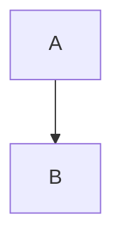

# Sample Code Review Report

This document demonstrates the structure of the Markdown report generated by
`reviewlens`. New sections for **Code Quality & Conventions**, **Hotspots**, and
an optional **Mermaid** diagram are included.

# Code Review Report

## Summary

Summary of the review findings.

## 🚨 Security Findings

✅ No issues found.

## 🧹 Code Quality & Conventions

No code quality issues found.

## 🔥 Hotspots

No hotspots identified.

## Diagram



---

## Appendix: Configuration Snapshot

```json
{ /* configuration used for the run */ }
```

The Mermaid section is optional and only included when a diagram is supplied.
